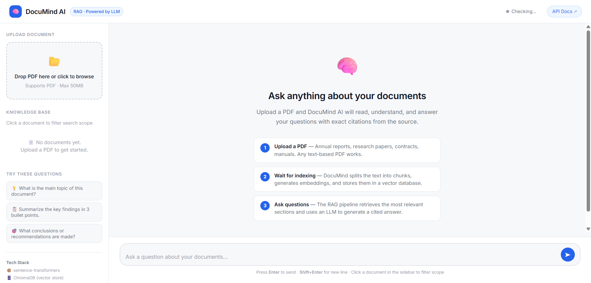
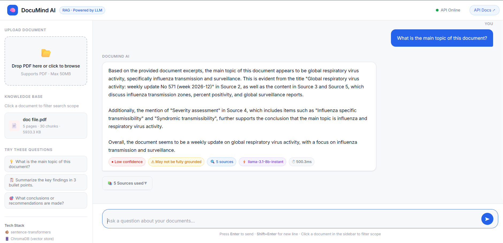
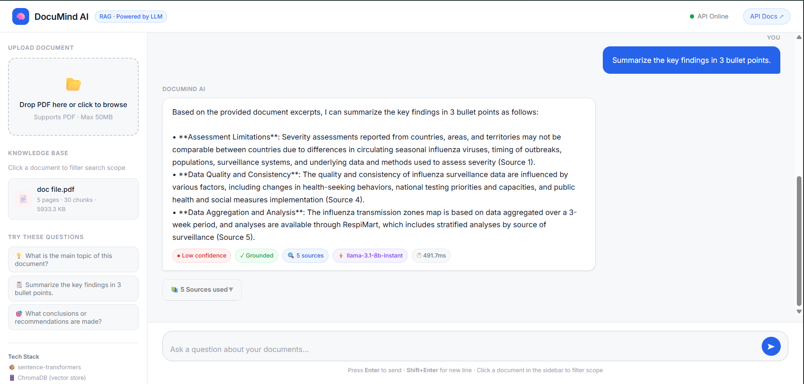
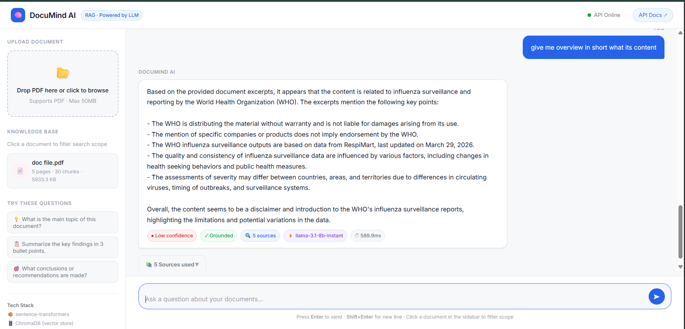

<div align="center">

# 🧠 DocuMind AI

### *Chat with your documents. Get cited, grounded answers.*

[](https://python.org)
[](https://fastapi.tiangolo.com)
[](https://groq.com)
[](https://www.trychroma.com)
[](https://docker.com)
[](LICENSE)

**DocuMind AI** is a production-grade Retrieval-Augmented Generation (RAG) system that lets you upload PDFs and ask intelligent questions — receiving accurate, cited answers powered by LLaMA3 via Groq.

[Features](#-features) • [Architecture](#-architecture) • [Tech Stack](#-tech-stack) • [Getting Started](#-getting-started) • [API Docs](#-api-reference) • [Project Structure](#-project-structure)

---

</div>

## 🎯 What Problem Does This Solve?

> People waste an average of **2.5 hours per day** searching through documents for answers.

DocuMind AI eliminates this by turning any PDF into an intelligent, queryable knowledge base. Upload your research papers, reports, or manuals — and simply *ask*.

---

## ✨ Features

- 📄 **PDF Ingestion** — Upload and process any PDF document instantly
- 🔍 **Semantic Search** — Finds meaning, not just keywords, using vector embeddings
- 🤖 **LLM-Powered Answers** — Grounded responses via LLaMA3 (8B) through Groq API
- 📎 **Citation-Based Output** — Every answer includes source references from your document
- 📊 **Confidence Scoring** — Know how reliable each answer is
- 🗄️ **Persistent Vector Store** — ChromaDB storage survives restarts
- ⚡ **REST API** — Full FastAPI backend with Swagger UI
- 🖥️ **Chat UI** — Clean, responsive vanilla JS frontend
- 🐳 **Docker Ready** — One-command deployment

---
## UI Interface

### 🖥️ Chat Interface


### 📄 PDF Upload


### 🤖 AI Response with Sources




---

## 💡 Use Cases

| Use Case | Example |
|----------|---------|
| 📚 **Research & Academia** | Upload a research paper and ask "What methodology did the authors use?" |
| 🏢 **Business Reports** | Query quarterly reports — "What were the key revenue drivers this quarter?" |
| ⚖️ **Legal Documents** | Extract clauses from contracts — "What are the termination conditions?" |
| 🛠️ **Technical Manuals** | Ask product docs — "How do I reset the device to factory settings?" |
| 🏥 **Medical Literature** | Summarize clinical studies — "What were the side effects observed?" |
| 🎓 **Study Assistant** | Upload lecture notes and quiz yourself interactively |

> **Tip:** DocuMind works best with text-heavy PDFs. Scanned image-only PDFs may yield lower accuracy without OCR preprocessing.

## 🏗️ Architecture

### End-to-End RAG Pipeline

```
📄 PDF Upload
     │
     ▼
┌─────────────────┐
│  Text Extraction │  ← PyMuPDF
└────────┬────────┘
         │
         ▼
┌─────────────────┐
│    Chunking      │  ← Size: 500 tokens | Overlap: 50
└────────┬────────┘
         │
         ▼
┌─────────────────┐
│   Embeddings     │  ← all-MiniLM-L6-v2 (dim: 384)
└────────┬────────┘
         │
         ▼
┌─────────────────┐
│  Vector Storage  │  ← ChromaDB (persistent)
└─────────────────┘

         🔎 At Query Time:

❓ User Question
     │
     ▼
┌─────────────────┐
│  Query Embedding │  ← Same model
└────────┬────────┘
         │
         ▼
┌─────────────────┐
│ Similarity Search│  ← FAISS cosine similarity | Top-5 chunks
└────────┬────────┘
         │
         ▼
┌─────────────────┐
│  LLM Generation  │  ← Groq LLaMA3 8B
└────────┬────────┘
         │
         ▼
✅ Answer + Sources + Confidence Score
```

---

## 🛠️ Tech Stack

| Layer | Technology |
|-------|-----------|
| **Backend** | FastAPI, Python 3.10+ |
| **Embeddings** | `sentence-transformers` (`all-MiniLM-L6-v2`) |
| **Vector DB** | ChromaDB (persistent) |
| **Similarity Search** | FAISS (cosine) |
| **LLM** | LLaMA3 8B via Groq API |
| **PDF Processing** | PyMuPDF |
| **Frontend** | Vanilla HTML, CSS, JavaScript |
| **Infrastructure** | Docker + docker-compose |

---

## 🚀 Getting Started

### Prerequisites

- Python 3.10+
- Docker & docker-compose (optional but recommended)
- A [Groq API key](https://console.groq.com)

### 1. Clone the Repository

```bash
git clone https://github.com/yourusername/documind-ai.git
cd documind-ai
```

### 2. Configure Environment

```bash
cp .env.example .env
```

Edit `.env` and add your credentials:

```env
GROQ_API_KEY=your_groq_api_key_here
```

### 3a. Run with Docker (Recommended)

```bash
docker-compose up --build
```

### 3b. Run Locally

```bash
# Create virtual environment
python -m venv venv
source venv/bin/activate  # Windows: venv\Scripts\activate

# Install dependencies
pip install -r requirements.txt

# Start the server
uvicorn app.main:app --reload --port 8000
```

### 4. Open the App

- **Chat UI:** [http://localhost:8000](http://localhost:8000)
- **Swagger API Docs:** [http://localhost:8000/docs](http://localhost:8000/docs)

---

## 📡 API Reference

| Endpoint | Method | Description |
|----------|--------|-------------|
| `/api/health` | `GET` | System health check |
| `/api/upload` | `POST` | Upload a PDF document |
| `/api/documents` | `GET` | List all uploaded documents |
| `/api/query` | `POST` | Ask a question ⭐ |
| `/docs` | `GET` | Swagger UI |

### Query Example

**Request:**
```json
POST /api/query
{
  "question": "What are the main findings of the report?",
  "top_k": 5
}
```

**Response:**
```json
{
  "answer": "The report concludes that...",
  "sources": [
    { "page": 4, "chunk": "...relevant excerpt..." },
    { "page": 7, "chunk": "...another source..." }
  ],
  "confidence": 0.91
}
```

---

## 📁 Project Structure

```
documind-ai/
├── app/
│   ├── main.py               # FastAPI app entry point
│   ├── routes.py             # API endpoints
│   ├── schemas.py            # Request/Response models
│   ├── config.py             # Environment configuration
│   └── logger.py             # Logging setup
│
├── services/
│   ├── pdf_processor.py      # PDF extraction + chunking
│   ├── embeddings.py         # Embedding model wrapper
│   ├── vector_store.py       # ChromaDB operations
│   └── rag_engine.py         # ⭐ Full pipeline orchestration
│
├── frontend/
│   ├── index.html            # Chat UI
│   ├── style.css             # Styling
│   └── app.js                # Frontend logic
│
├── data/
│   ├── uploads/              # Uploaded PDFs (gitignored)
│   └── vectorstore/          # ChromaDB embeddings (gitignored)
│
├── notebooks/                # Experiment notebooks
├── tests/                    # API test suite
├── docs/                     # Visual analysis & diagrams
├── docker-compose.yml
├── Dockerfile
├── requirements.txt
├── .env.example
└── README.md
```

---

## ⚙️ Configuration

| Variable | Description | Default |
|----------|-------------|---------|
| `GROQ_API_KEY` | Your Groq API key | *required* |
| `CHUNK_SIZE` | Token size per chunk | `500` |
| `CHUNK_OVERLAP` | Overlap between chunks | `50` |
| `TOP_K` | Top chunks to retrieve | `5` |
| `EMBEDDING_MODEL` | Sentence transformer model | `all-MiniLM-L6-v2` |

---

## 🧪 Running Tests

```bash
pytest tests/ -v
```

---

## ⚠️ Before Pushing to GitHub

Make sure your `.gitignore` includes:

```gitignore
# Environment
.env
venv/
__pycache__/

# Data (can be large)
data/uploads/
data/vectorstore/

# OS
.DS_Store
```

---

## 🗺️ Roadmap

- [ ] Multi-document cross-referencing
- [ ] Chat history persistence
- [ ] Support for DOCX, TXT, and web URLs
- [ ] Authentication & user sessions
- [ ] Streaming responses (SSE)
- [ ] Deploy to cloud (AWS / GCP / Railway)

---

---

## 📈 Performance & Limitations

### Benchmarks

| Metric | Value |
|--------|-------|
| Avg. query response time | ~1.5–3s (Groq API) |
| Embedding model size | ~90MB (`all-MiniLM-L6-v2`) |
| Max recommended PDF size | ~50 pages (for optimal chunking) |
| Retrieval accuracy (top-5) | High for text-dense, well-structured PDFs |
| Supported file type | PDF only (v1.0) |

### Known Limitations

- **Scanned PDFs** — Image-only PDFs are not supported without an OCR preprocessing step. PyMuPDF extracts embedded text only.
- **Large documents** — PDFs exceeding ~100 pages may increase ingestion time and reduce retrieval precision without tuning chunk size.
- **Confidence scores are approximate** — The confidence value reflects embedding similarity, not factual correctness. Always verify critical answers against the source.
- **No chat memory** — Each query is independent; the system does not retain conversation context between questions.
- **Single document per query** — Cross-document querying is not yet supported (see Roadmap).
- **Language** — Optimized for English-language documents. Multilingual support is untested.

## 🤝 Contributing

Contributions are welcome! Please open an issue first to discuss what you'd like to change.

1. Fork the repository
2. Create your feature branch (`git checkout -b feature/amazing-feature`)
3. Commit your changes (`git commit -m 'Add amazing feature'`)
4. Push to the branch (`git push origin feature/amazing-feature`)
5. Open a Pull Request

---

## 📄 License

This project is licensed under the MIT License — see the [LICENSE](LICENSE) file for details.

---

<div align="center">

**Built with ❤️ using FastAPI, LLaMA3, and ChromaDB**

*If this project helped you, consider giving it a ⭐ on GitHub!*

</div>
